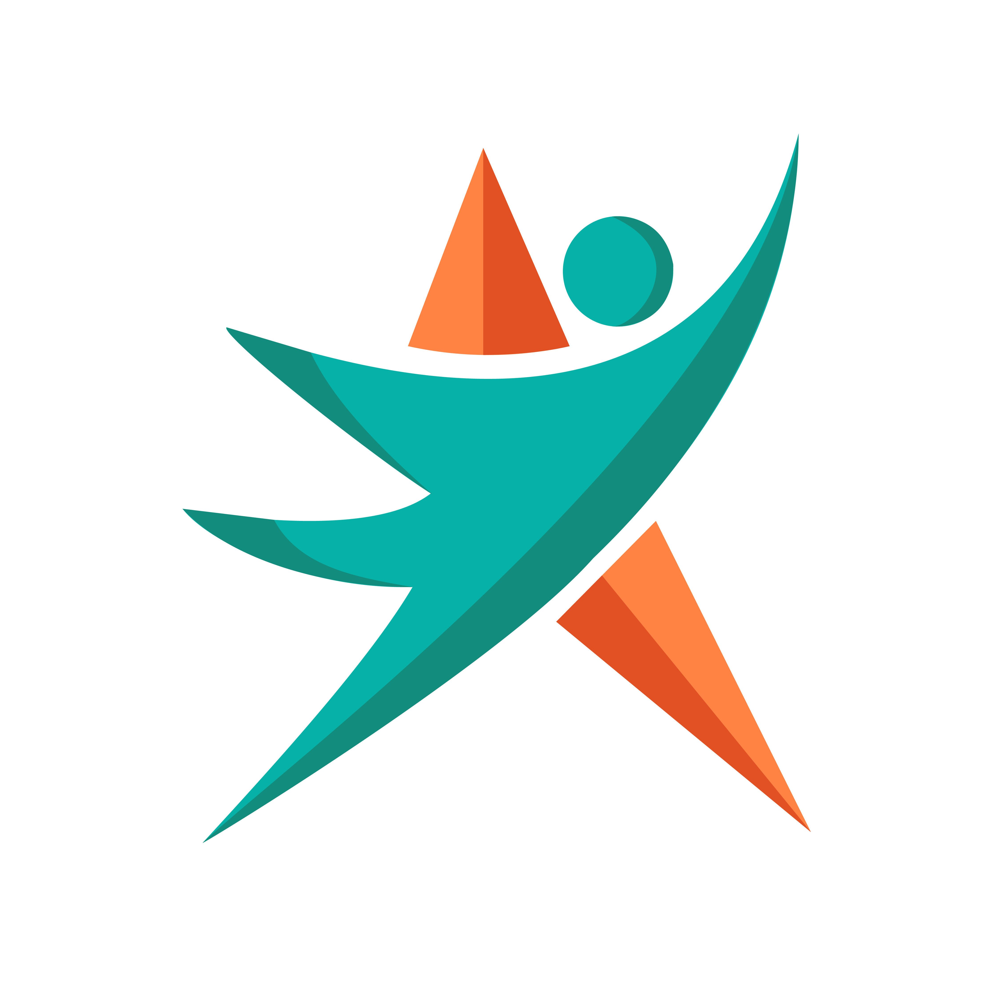

<p align="center">
  
</p>

<h1 align="center">🌿 HealThyself</h1>

<p align="center">
  <strong>Aplikasi Edukasi Kesehatan Interaktif Berdasarkan Kelompok Usia</strong>
  <br />
  <em>Gerakan Sekolah Sehat — AWS x Sagasitas 2024</em>
  <br />
  <br />
  <a href="https://healthyself.vercel.app" target="_blank">🌐 Demo</a>
  ·
  <a href="https://healthyself-dev.vercel.app" target="_blank">🌐 Demo (Dev)</a>
</p>

---

## 📋 Daftar Isi

- [Tentang Proyek](#-tentang-proyek)
- [Tujuan](#-tujuan)
- [Fitur](#-fitur)
- [Teknologi](#-teknologi)
- [Struktur Proyek](#-struktur-proyek)
- [Halaman & Konten](#-halaman--konten)
- [Tema Warna](#-tema-warna)
- [Cara Instalasi & Menjalankan](#-cara-instalasi--menjalankan)
- [Build & Deploy](#-build--deploy)
- [Tim Pengembang](#-tim-pengembang)

---

## 🧠 Tentang Proyek

**HealThyself** adalah aplikasi web *single-page* (SPA) interaktif yang menyajikan panduan kesehatan dan gaya hidup sehat yang disesuaikan berdasarkan **5 kelompok usia**: Bayi, Anak-Anak, Remaja, Dewasa, dan Lansia.

Aplikasi ini menggabungkan **teknologi web modern** seperti React, Three.js (3D), animasi, dan chatbot untuk memberikan pengalaman belajar yang menarik, visual, dan mudah dipahami oleh semua kalangan.

Setiap halaman kelompok usia mencakup informasi lengkap tentang:
- 📊 Panduan tumbuh kembang (grafik tinggi/berat)
- 🥗 Panduan gizi dan pola makan
- 💉 Jadwal imunisasi
- 🧘 Perawatan kesehatan mental
- 🌱 Kesehatan lingkungan
- 🩺 Konsultasi kesehatan

---

## 🎯 Tujuan

Proyek ini dibuat untuk mengikuti **Lomba Gerakan Sekolah Sehat** yang diselenggarakan oleh:

<p align="center">
  <strong>AWS (Amazon Web Services) × Sagasitas</strong>
  <br />
  <em>Tahun 2024</em>
</p>

Tujuan utama dari aplikasi ini adalah:
1. **Meningkatkan literasi kesehatan** masyarakat Indonesia melalui media digital yang interaktif
2. **Menyediakan konten kesehatan yang sesuai** untuk setiap tahapan usia
3. **Memanfaatkan teknologi 3D & multimedia** untuk membuat edukasi kesehatan lebih menarik dan tidak membosankan
4. **Memperkenalkan Gerakan Sekolah Sehat** secara lebih luas kepada masyarakat

---

## ✨ Fitur

### 🏠 Halaman Utama
- **Video Background** — Video fullscreen sebagai latar halaman utama
- **Tombol Mulai** — Animasi transisi menuju pemilihan kategori usia
- **Dialog Selamat Datang** — Maskot interaktif dengan audio sambutan
- **Navigasi Sederhana** — Tombol menuju halaman Tim

### 🎪 Pemilihan Kategori (Option Page)
- **Carousel 3D Interaktif** — 5 kartu kategori usia dengan model 3D GLB yang dapat dirotasi
- **Kontrol Navigasi** — Tombol prev/next, slide dengan efek smooth
- **Awan Interaktif** — Dekorasi awan yang bergerak mengikuti pergerakan mouse
- **Maskot Animasi** — GIF maskot dengan percakapan selamat datang

### 👶👧🧑👨👴 Halaman Kelompok Usia (5 Halaman)
Setiap halaman memiliki struktur yang konsisten:

| Bagian | Deskripsi |
|--------|-----------|
| **Navbar** | Navigasi tetap dengan menu gulir ke section + dropdown "Golongan" |
| **Hero** | Model 3D (GLB), gelombang dekoratif, kartu info dengan glassmorphism, bola-bola animasi |
| **Panduan** | Grafik batang (Chart.js) data tinggi/berat badan sesuai usia |
| **Video** | Pemutar video kustom dengan efek awan |
| **Gizi** | Akordeon interaktif berisi panduan gizi & pola makan |
| **Gizi (Carousel)** | Carousel gambar informasi nutrisi menggunakan react-slick |
| **Imunisasi** | Swiper vertikal dengan kartu jadwal imunisasi |
| **Perawatan** | Swiper vertikal dengan tips kesehatan mental |
| **Lingkungan** | Grid 2×3 kartu kesehatan lingkungan |
| **Konsultasi** | Formulir konsultasi (nama, telepon, email, pesan) + ilustrasi |
| **Footer** | Logo, kontak, tautan konten, sumber data, kredit tim |

### 🤖 HealBot (Chatbot)
- Tombol chatbot mengambang di pojok kanan bawah
- Dialog overlay dengan daftar pesan (scroll area)
- Input teks untuk bertanya
- Respons otomatis (simulasi)
- Desain modern menggunakan komponen Radix UI

### 📱 Fitur Lainnya
- **Floating Balls** — Dekorasi lingkaran animasi melayang
- **Tombol Scroll-to-Top** — Muncul setelah scroll 500px
- **Animasi Scroll (AOS)** — Efek kemunculan saat discroll
- **Typed.js** — Teks animasi mengetik otomatis
- **Hero Button** — Tombol "Selengkapnya" dengan efek hover ekspansi
- **Fully Responsive** — Tampilan menyesuaikan layar mobile, tablet, dan desktop

---

## 🛠 Teknologi

### Frontend

| Teknologi | Kegunaan |
|-----------|----------|
| **React 18** | Framework UI berbasis komponen |
| **Vite 5** | Bundler & dev server cepat |
| **React Router DOM 6** | Routing SPA (7 rute) |
| **Tailwind CSS 3** | Utility-first CSS framework |
| **PostCSS & Autoprefixer** | CSS processing |

### 3D & Visual

| Teknologi | Kegunaan |
|-----------|----------|
| **@react-three/fiber** | Three.js untuk React |
| **@react-three/drei** | Utility Three.js (OrbitControls, useGLTF, dll) |
| **react-three-fiber** | Three.js canvas renderer |
| **Model GLB** | 5 model 3D karakter (Bayi, Anak, Remaja, Dewasa, Lansia) |

### UI Components

| Teknologi | Kegunaan |
|-----------|----------|
| **Swiper 11** | Carousel touch interaktif |
| **react-slick + slick-carousel** | Carousel gambar |
| **Radix UI** | Komponen headless (Avatar, Dialog, ScrollArea, Slot) |
| **shadcn/ui** | Gaya komponen (Button, Input) |
| **Flowbite** | Plugin Tailwind UI |
| **AOS (Animate on Scroll)** | Animasi scroll |
| **Typed.js** | Efek teks mengetik |
| **Chart.js + react-chartjs-2** | Grafik batang data tumbuh kembang |

### Icons

| Teknologi | Kegunaan |
|-----------|----------|
| **FontAwesome 6** | Icons (solid + brands) |
| **Ionicons** | Icons tambahan |
| **Lucide React** | Icons tambahan |

### Utility

| Teknologi | Kegunaan |
|-----------|----------|
| **clsx** | Class name utility |
| **tailwind-merge** | Merge Tailwind classes |
| **class-variance-authority** | Variasi komponen (CVA) |

### Deployment

| Teknologi | Kegunaan |
|-----------|----------|
| **Vercel** | Hosting & deployment |
| **vercel.json** | Konfigurasi SPA rewrites |

### Dev Tools

| Teknologi | Kegunaan |
|-----------|----------|
| **ESLint 9** | Linting JavaScript/JSX |
| **eslint-plugin-react** | Aturan ESLint untuk React |
| **eslint-plugin-react-hooks** | Aturan ESLint untuk React Hooks |
| **eslint-plugin-react-refresh** | Aturan ESLint untuk React Refresh |

---

## 📁 Struktur Proyek

```
HealThyself/
├── public/                          # Aset statis
│   ├── assets/                      # Gambar konten
│   │   ├── Anak.png, Dewasa.png, Remaja.png, OrangTua.png
│   │   ├── emak-anak.webp, konsul.png
│   │   ├── adult/, teen/, elderly/, child/  # Wave SVG per kategori
│   ├── audio/                       # Audio
│   │   ├── welcome.mp3, pilih.mp3, datang.mp3
│   ├── background/                  # Background & dekorasi
│   │   ├── background.mp4           # Video latar halaman utama
│   │   ├── anak.mp4, remaja.mp4, dewasa.mp4, lansia.mp4
│   │   ├── golongan.png
│   │   ├── wave*.png               # Gelombang dekoratif per warna
│   │   ├── awan*.png, awan*.webp   # Awan dekoratif
│   │   ├── bg-imunisasi*.png       # Background imunisasi per warna
│   ├── icons/                       # Ikon
│   │   ├── bahagia.png, piala.png, terampil.png, headset.png
│   ├── konsultasi/                  # Ilustrasi konsultasi
│   │   ├── baby.png, child.png, teen.png, adult.png, ederly.png
│   ├── maskot/                      # Maskot animasi
│   │   ├── diam.png, datang.gif, pilih.gif
│   ├── Model/                       # Model 3D GLB
│   │   ├── Bayi.glb, Anak.glb, Remaja.glb, Dewasa.glb, Kakek.glb
│   ├── team/                        # Foto tim
│   │   ├── aldo.jpg, akmal.jpg, nazla.jpg, rama.jpg, salman.jpg
│   ├── logo.png, logofull.png, maskot.png, vite.svg
│
├── src/                             # Kode sumber
│   ├── main.jsx                     # Entry point React
│   ├── App.jsx                      # Root component + routing
│   ├── index.css                    # Style global + Tailwind
│   │
│   ├── context/
│   │   └── stateContext.jsx         # Context state (open/close halaman)
│   │
│   ├── layout/
│   │   └── HomeLayout.jsx           # Layout halaman utama (Home ↔ Option)
│   │
│   ├── Pages/                       # Halaman aplikasi
│   │   ├── Home.jsx                 # Halaman landing (video fullscreen)
│   │   ├── Option.jsx               # Pemilihan kategori usia (3D carousel)
│   │   ├── Baby.jsx                 # Kesehatan Bayi (1-12 bulan)
│   │   ├── Child.jsx                # Kesehatan Anak (3-12 tahun)
│   │   ├── Teen.jsx                 # Kesehatan Remaja (13-17 tahun)
│   │   ├── Adult.jsx                # Kesehatan Dewasa (18-59 tahun)
│   │   ├── Elderly.jsx              # Kesehatan Lansia (60+ tahun)
│   │   └── Team.jsx                 # Halaman tim pengembang
│   │
│   ├── Components/                  # Komponen reusable
│   │   ├── HomeNav.jsx              # Navbar sederhana (halaman utama/team)
│   │   ├── Navbar.jsx               # Navbar utama dengan dropdown
│   │   ├── HeroButton.jsx           # Tombol animasi "Selengkapnya"
│   │   ├── Ball.jsx                 # Bola dekoratif melayang
│   │   ├── ModelCanvas.jsx          # Canvas Three.js + model 3D
│   │   ├── CustomVideo.jsx          # Pemutar video kustom
│   │   ├── Corousel.jsx             # Carousel gambar (react-slick)
│   │   ├── Dialog.jsx               # Dialog selamat datang + maskot
│   │   ├── Footer.jsx               # Footer dengan sub-komponen
│   │   ├── ToUp.jsx                 # Tombol scroll-to-top
│   │   ├── TextAnimated.jsx         # Teks animasi (Typed.js)
│   │   ├── SwiperButton.jsx         # Tombol swiper bernomor bulan
│   │   ├── Accordion.jsx            # Komponen akordeon reusable
│   │   │
│   │   ├── Models/                  # Model 3D React Three Fiber
│   │   │   ├── Bayi.jsx, Anak.jsx, Teen.jsx, Dewasa.jsx, Kakek.jsx
│   │   │   └── landingPage/
│   │   │       └── Bayi.jsx         # Model bayi untuk landing page
│   │   │
│   │   └── ChatBot/                 # Komponen chatbot
│   │       ├── ChatBot.jsx          # Chatbot utama
│   │       ├── Button.jsx           # Tombol (shadcn/ui style)
│   │       ├── Avatar.jsx           # Avatar (Radix UI)
│   │       ├── Dialog.jsx           # Dialog (Radix UI)
│   │       ├── Input.jsx            # Input teks
│   │       ├── ScrollArea.jsx       # Scroll area (Radix UI)
│   │       └── lib.jsx              # Utility cn()
│   │
│   └── docs/                        # Data konten
│       ├── Accordion.jsx            # Data gizi Bayi
│       ├── AccordionChild.jsx       # Data gizi Anak
│       ├── AccordionTeen.jsx        # Data gizi Remaja
│       ├── AccordionAdult.jsx       # Data gizi Dewasa
│       ├── AccordionLansia.jsx      # Data gizi Lansia
│       └── Imunisasi.jsx            # Data imunisasi (placeholder)
│
├── index.html                       # HTML entry point
├── package.json                     # Daftar dependencies & scripts
├── vite.config.js                   # Konfigurasi Vite
├── tailwind.config.js               # Konfigurasi Tailwind (custom colors)
├── postcss.config.js                # Konfigurasi PostCSS
├── eslint.config.js                 # Konfigurasi ESLint (flat config)
├── vercel.json                      # Konfigurasi deploy Vercel
├── .gitignore                       # Git ignore rules
├── PETUNJUK.TXT                     # Panduan instalasi singkat
└── README.md                        # Dokumentasi ini
```

---

## 🎨 Tema Warna

Setiap kelompok usia memiliki **tema warna yang unik** yang diterapkan di seluruh komponen:

| Kelompok Usia | Rentang Usia | Warna Utama | Warna Terang |
|---------------|-------------|-------------|--------------|
| 👶 **Bayi** | 1–12 bulan | `#0D46A4` (Biru) | `#ABCAFF` |
| 👧 **Anak-Anak** | 3–12 tahun | `#E33B3B` (Merah) | `#FFD7D7` |
| 🧑 **Remaja** | 13–17 tahun | `#0E9D75` (Hijau) | `#1CB08F` |
| 👨 **Dewasa** | 18–59 tahun | `#F36932` (Oranye) | `#FF895B` |
| 👴 **Lansia** | 60+ tahun | `#16AE79` (Toska) | `#4CE1AD` |

Warna global:
- **Primary:** `#0D9B86` (Hijau tua)
- **Secondary:** `#FF682C` (Oranye)
- **Font:** Poppins & RadioCanada

---

## 🚀 Cara Instalasi & Menjalankan

### Prasyarat

Pastikan Anda telah menginstal:
- **Node.js** (versi 18 atau lebih baru) — [Download Node.js](https://nodejs.org/)
- **npm** (biasanya sudah termasuk dengan Node.js)

### Langkah-langkah

#### 1. Clone Repository

```bash
git clone https://github.com/username/HealThyself.git
cd HealThyself
```

> *Jika tidak menggunakan Git, Anda bisa download ZIP dan ekstrak, lalu buka folder tersebut di terminal.*

#### 2. Install Dependencies

```bash
npm install
```

Perintah ini akan mengunduh dan menginstal semua package yang diperlukan (React, Three.js, Tailwind, Swiper, dll) berdasarkan `package-lock.json`.

#### 3. Jalankan Server Development

```bash
npm run dev
```

Setelah perintah dijalankan, Anda akan melihat output seperti:

```
  VITE v5.x.x  ready in XXX ms
  ➜  Local:   http://localhost:5173/
  ➜  Network: use --host to expose
```

Buka **http://localhost:5173/** di browser Anda.

#### 4. Build untuk Production

```bash
npm run build
```

Hasil build akan tersimpan di folder `dist/` dan siap di-deploy.

#### 5. Preview Build

```bash
npm run preview
```

Menjalankan server lokal untuk melihat hasil build production.

### Scripts yang Tersedia

| Script | Deskripsi |
|--------|-----------|
| `npm run dev` | Menjalankan development server (Vite) |
| `npm run build` | Build aplikasi untuk production |
| `npm run preview` | Preview hasil build secara lokal |
| `npm run lint` | Menjalankan ESLint untuk cek kualitas kode |

### Catatan Penting

- **Model 3D (GLB)** dan **video background** berukuran besar — pastikan koneksi internet stabil saat pertama kali memuat halaman
- Aplikasi menggunakan **CDN eksternal** untuk Swiper CSS dan Ionicons — koneksi internet diperlukan
- Jika mengalami error, coba hapus `node_modules` dan `package-lock.json`, lalu jalankan `npm install` ulang

---

## ☁️ Build & Deploy

### Deploy ke Vercel

Proyek ini sudah dikonfigurasi untuk deploy ke Vercel dengan file `vercel.json`:

```json
{
  "rewrites": [
    {
      "source": "/(.*)",
      "destination": "/"
    }
  ]
}
```

Konfigurasi di atas memastikan **client-side routing** berfungsi dengan benar (semua rute diarahkan ke `index.html`).

**Langkah deploy:**
1. Push repository ke GitHub
2. Import project ke [Vercel](https://vercel.com)
3. Vercel akan otomatis mendeteksi Vite dan menjalankan `npm run build`
4. Selesai!

### Demo Live

| Environment | URL |
|-------------|-----|
| **Production** | [https://healthyself.vercel.app](https://healthyself.vercel.app) |
| **Development** | [https://healthyself-dev.vercel.app](https://healthyself-dev.vercel.app) |

---

## 👥 Tim Pengembang

Proyek ini dikembangkan oleh **5 anggota tim** untuk lomba Gerakan Sekolah Sehat AWS × Sagasitas 2024:

| Nama | Peran | GitHub | LinkedIn | Instagram |
|------|-------|--------|----------|-----------|
| **Muhammad Salman Alfarisi** | Leader & Data Analyst | [@avlfarizi](https://github.com/avlfarizi) | [LinkedIn](https://www.linkedin.com/in/muhammad-salman-al-farisi-14a517324/) | [@avlfarizi](https://www.instagram.com/avlfarizi/) |
| **Reynaldo Yusellino** | Programmer | [@reynaldo0](https://github.com/reynaldo0) | [LinkedIn](https://www.linkedin.com/in/reynaldo-yusellino-564724270) | [@rynldysllino](https://www.instagram.com/rynldysllino/) |
| **Ramadina Almusthazam** | Programmer | [@ramarfx](https://github.com/ramarfx) | [LinkedIn](https://id.linkedin.com/in/ramadina-al-muzthazam-5028482a2) | [@ramtxh](https://instagram.com/ramtxh) |
| **Nazla Rahma** | UI/UX & Illustrator | [@zlaraa](https://github.com/zlaraa) | [LinkedIn](https://www.linkedin.com/in/nazla-rahma) | [@nazlarhm96](https://www.instagram.com/nazlarhm96) |
| **Muhammad Akmal Saban** | Programmer | [@AkmaldanKamu](https://github.com/AkmaldanKamu) | [LinkedIn](https://id.linkedin.com/in/ramadina-al-muzthazam-5028482a2) | [@m.akmal.saban](https://www.instagram.com/m.akmal.saban) |

---

## 📄 Lisensi

Proyek ini dibuat untuk tujuan **kompetisi/lomba**. Semua aset (gambar, model 3D, audio, video) adalah milik tim pengembang kecuali disebutkan lain.

---

<p align="center">
  Dibuat dengan ❤️ untuk <strong>Gerakan Sekolah Sehat</strong><br />
  AWS × Sagasitas 2024
</p>
